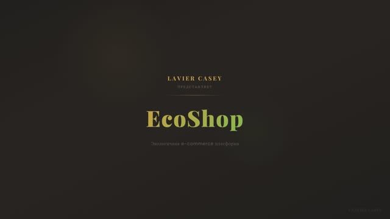

<a id="top"></a>

<p align="right">
  <a href="README.en.md">English</a>
</p>

<p align="center">
  
</p>

<h1 align="center">EcoShop</h1>

<p align="center">
  <em>Полнофункциональная e-commerce платформа экотоваров</em><br>
  <em>Laravel 12 API + React 19 SPA + TypeScript + Feature-Sliced Design</em>
</p>

<p align="center">
  
  
  
  
  
  
  
</p>

<p align="center">
  <a href="#-демо">Демо</a>&nbsp;&nbsp;|&nbsp;&nbsp;
  <a href="#-возможности">Возможности</a>&nbsp;&nbsp;|&nbsp;&nbsp;
  <a href="#-быстрый-старт">Быстрый старт</a>&nbsp;&nbsp;|&nbsp;&nbsp;
  <a href="#-технологии">Технологии</a>&nbsp;&nbsp;|&nbsp;&nbsp;
  <a href="#-тестирование">Тестирование</a>&nbsp;&nbsp;|&nbsp;&nbsp;
  <a href="#-архитектура">Архитектура</a>&nbsp;&nbsp;|&nbsp;&nbsp;
  <a href="#-планы-развития">Планы</a>
</p>

---

## Демо

<p align="center">
  <a href="https://rutube.ru/video/private/717b19491bab80840b4b8b5b2614a224/?p=26IFFLwp0n86L0jR8tXlEw">
    
  </a>
  <br>
  <sub>Нажмите на превью для просмотра видео на Rutube</sub>
</p>

---

## О проекте

**EcoShop** — production-ready интернет-магазин экологичных товаров. Laravel отвечает за API и бизнес-логику, React — за клиентское SPA с собственным роутингом. Фронтенд построен по методологии **Feature-Sliced Design**, бэкенд покрыт тестами на **Pest**, фронтенд — на **Vitest**. Файловое хранилище не привязано к конкретному провайдеру — переключение между локальным диском и S3-совместимым хранилищем одной переменной окружения. Вся инфраструктура упакована в **Docker** и готова к деплою.

---

## Возможности

<table>
<tr>
<td valign="top" width="50%">

### Покупатели

- Каталог товаров с категориями и фильтрами
- Полнотекстовый поиск (Meilisearch)
- Корзина с управлением количеством
- Оформление заказа с отслеживанием статуса
- Личный кабинет, история заказов, адреса
- Контактная форма, статические страницы
- PWA — установка на мобильное устройство

</td>
<td valign="top" width="50%">

### Администраторы

- Ролевая модель доступа (admin / order_manager / content_manager)
- Управление товарами с мульти-загрузкой изображений
- Дерево категорий с сортировкой
- Обработка заказов с workflow статусов
- Управление баннерами и контентом страниц
- Настройки сайта через админку

</td>
</tr>
</table>

<p align="right"><a href="#top">наверх</a></p>

---

## Быстрый старт

### Docker (рекомендуется)

```bash
git clone https://github.com/YOUR_USERNAME/ecoshop.git
cd ecoshop
cp .env.example .env
```

Задайте пароль администратора в `.env`:

```env
ADMIN_PASSWORD=ваш_надёжный_пароль
```

```bash
docker compose up -d --build
# Миграции и создание админа выполняются автоматически при старте
```

Откройте **http://localhost** в браузере. Вход: `admin@ecoshop.ru` + ваш пароль.

<details>
<summary>Заполнение демо-данными</summary>

<br>

```bash
docker compose exec app php artisan db:seed
docker compose exec app php artisan cache:clear
```

Создаются тестовые товары, категории, баннеры, заказы и пользователи. Пароль всех тестовых аккаунтов: `password`.

</details>

<details>
<summary>Тестовые аккаунты (после db:seed)</summary>

<br>

Пароль всех тестовых аккаунтов: `password`.

| Роль | Email |
|:--|:--|
| Администратор | `admin@ecoshop.ru` |
| Менеджер заказов | `manager@ecoshop.ru` |
| Контент-менеджер | `content@ecoshop.ru` |
| Покупатель | `ivanov@example.com` |

</details>

<details>
<summary>Локальная разработка (без Docker)</summary>

<br>

Требования: PHP 8.2+, Node.js 24+, Composer, PostgreSQL, Redis.

```bash
composer install && npm install
cp .env.example .env
php artisan key:generate
php artisan migrate && php artisan db:seed
composer dev
```

`composer dev` запускает параллельно: PHP-сервер, очередь, логи (Pail) и Vite.

</details>

<p align="right"><a href="#top">наверх</a></p>

---

## Технологии

<table>
<tr>
<td valign="top" width="50%">

### Бэкенд

| | Технология |
|:--|:--|
| Фреймворк | **Laravel 12**, PHP 8.2+ |
| Поиск | **Laravel Scout** + Meilisearch |
| Аутентификация | **Laravel Sanctum** |
| Роли и права | **Spatie Permission** |
| URL-слаги | **Spatie Sluggable** |
| Сортировка | **Spatie Sortable** |
| Тесты | **Pest** |
| Анализ | **Larastan** (PHPStan) |
| Форматирование | **Laravel Pint** |

</td>
<td valign="top" width="50%">

### Фронтенд

| | Технология |
|:--|:--|
| UI | **React 19** + TypeScript 5.9 |
| Стили | **Tailwind CSS 4** |
| Стейт | **Zustand** |
| Серверный стейт | **React Query** |
| Анимации | **Framer Motion** |
| Компоненты | **Headless UI** |
| Иконки | **Lucide React** |
| Сборка | **Vite 7** |
| Тесты | **Vitest** + Testing Library |
| Архитектура | **Feature-Sliced Design** |
| Линтинг | **ESLint** + Steiger (FSD) |

</td>
</tr>
</table>

<p align="right"><a href="#top">наверх</a></p>

---

## Тестирование

Проект покрыт тестами на двух уровнях — бэкенд и фронтенд:

```bash
# Бэкенд — Pest (Feature + Unit)
php artisan test

# Фронтенд — Vitest
npm run test:run

# Статический анализ PHP
vendor/bin/phpstan analyse

# Проверка типов TypeScript
npm run type-check
```

| Уровень | Фреймворк | Покрытие |
|:--|:--|:--|
| **Feature-тесты** | Pest | Auth, Cart, Catalog, Checkout, Admin, Home, Account, Contact, Page |
| **Unit-тесты** | Pest | Models, Enums |
| **Фронтенд** | Vitest + Testing Library | Утилиты, хуки, API-клиент, маршруты |
| **Статический анализ** | Larastan + TypeScript | Типобезопасность бэкенда и фронтенда |
| **Архитектура** | Steiger | Соответствие правилам Feature-Sliced Design |

<p align="right"><a href="#top">наверх</a></p>

---

## Архитектура

### Feature-Sliced Design (фронтенд)

```
resources/js/
├── app/        — Лейауты, роутер, глобальные провайдеры
├── pages/      — Страницы (home, catalog, cart, checkout, admin/*)
├── widgets/    — Составные блоки UI (header, footer, admin sidebar)
├── features/   — Пользовательские сценарии (auth)
├── entities/   — Бизнес-сущности (product, category, cart, order, user, banner)
└── shared/     — UI-кит, хуки, утилиты, типы, API-клиент
```

### Docker-инфраструктура

```
  Nginx (:80) ──▶ PHP-FPM (:9000) ──▶ PostgreSQL (:5432)
                      │
  Vite (:5173)        ├──▶ Redis (:6379)
                      │
                      └──▶ Meilisearch (:7700)

                           Mailpit (:8025)
```

<details>
<summary>Сервисы и порты</summary>

<br>

| Сервис | Порт | Назначение |
|:--|:--|:--|
| **Nginx** | `80` | Веб-сервер (reverse proxy → PHP-FPM) |
| **Vite** | `5173` | HMR dev-сервер |
| **PostgreSQL** | `5432` | Основная база данных |
| **Redis** | `6379` | Кеш, сессии, очереди |
| **Meilisearch** | `7700` | Полнотекстовый поиск |
| **Mailpit** | `1025` / `8025` | Перехват email (SMTP / Web UI) |

</details>

<details>
<summary>Структура проекта</summary>

<br>

```
ecoshop/
├── app/
│   ├── Actions/          # Одноразовые действия
│   ├── Enums/            # PHP enums (UserRole, OrderStatus, ...)
│   ├── Events/           # Доменные события
│   ├── Http/
│   │   ├── Controllers/  # Контроллеры (Web + Admin)
│   │   ├── Middleware/    # Авторизация по ролям
│   │   ├── Requests/     # Валидация форм
│   │   └── Resources/    # API-ресурсы
│   ├── Listeners/        # Обработчики событий
│   ├── Mail/             # Почтовые шаблоны
│   ├── Models/           # Eloquent-модели
│   └── Providers/        # Сервис-провайдеры
├── database/
│   ├── factories/        # Фабрики моделей
│   ├── migrations/       # Миграции БД
│   └── seeders/          # Сидеры тестовых данных
├── docker/
│   ├── nginx/            # Конфигурация Nginx
│   └── php/              # Dockerfile, entrypoint, php.ini, opcache
├── resources/
│   ├── css/              # Глобальные стили
│   ├── js/               # Фронтенд (FSD)
│   └── views/            # Blade-шаблоны
├── routes/               # web.php, api.php
├── tests/
│   ├── Feature/          # Интеграционные тесты
│   └── Unit/             # Юнит-тесты
├── docker-compose.yml
└── vite.config.ts
```

</details>

<details>
<summary>Доступные скрипты</summary>

<br>

| Команда | Описание |
|:--|:--|
| `composer dev` | Запуск всех dev-процессов параллельно |
| `composer test` | Тесты бэкенда (Pest) |
| `composer setup` | Полная установка проекта |
| `vendor/bin/phpstan analyse` | Статический анализ PHP |
| `vendor/bin/pint` | Автоформатирование PHP |
| `npm run dev` | Vite dev-сервер с HMR |
| `npm run build` | Продакшн-сборка |
| `npm run test` | Тесты фронтенда (Vitest) |
| `npm run lint` | ESLint |
| `npm run lint:fsd` | Проверка FSD-архитектуры |
| `npm run type-check` | Проверка типов TypeScript |

</details>

<p align="right"><a href="#top">наверх</a></p>

---

## Планы развития

- [ ] **Аналитика и метрики** — дашборд с воронкой продаж, конверсиями, средним чеком, LTV
- [ ] **UTM-метки** — отслеживание рекламных кампаний, источников трафика, атрибуция заказов
- [ ] **Cookie-баннер и GDPR** — управление согласием, категоризация cookie (аналитика, маркетинг, необходимые)
- [ ] **Интеграция с Яндекс.Метрикой** — e-commerce цели, события добавления в корзину, оформления заказа
- [ ] **A/B тестирование** — сплит-тесты баннеров, карточек товаров, checkout-flow
- [ ] **Отчёты по заказам** — экспорт в Excel, фильтрация по периоду, статусу, источнику
- [ ] **Программа лояльности** — бонусные баллы, промокоды, реферальная система
- [ ] **Уведомления** — Telegram/email-оповещения о заказах, возвратах, низком остатке
- [ ] **SEO-модуль** — автогенерация sitemap, OpenGraph-метатеги, микроразметка Schema.org
- [ ] **Мультиязычность** — i18n фронтенда и контента через админку

---

## Лицензия

Распространяется под лицензией MIT. Подробнее — [LICENSE](LICENSE).

<p align="right"><a href="#top">наверх</a></p>
